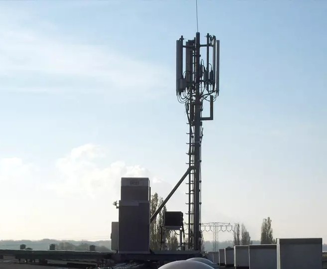
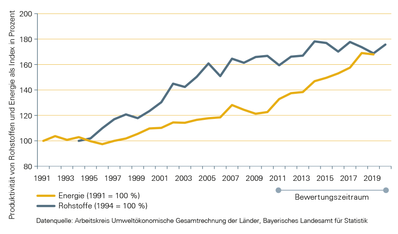
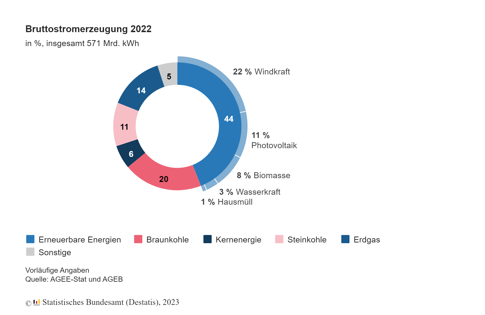
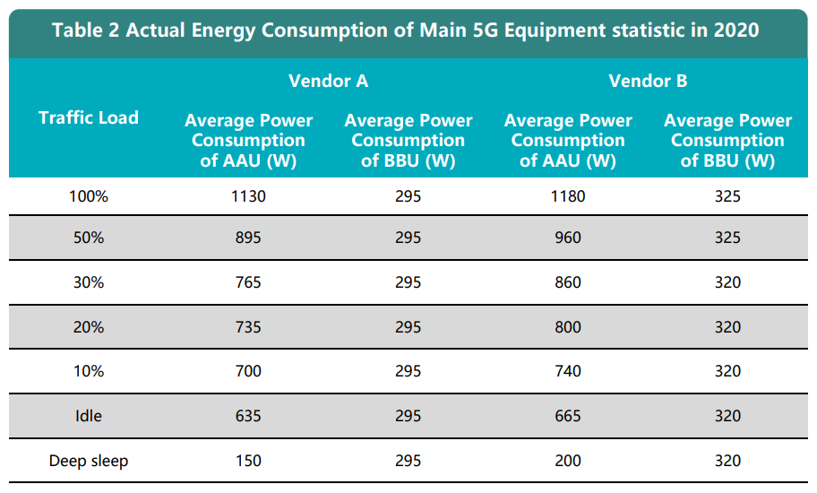
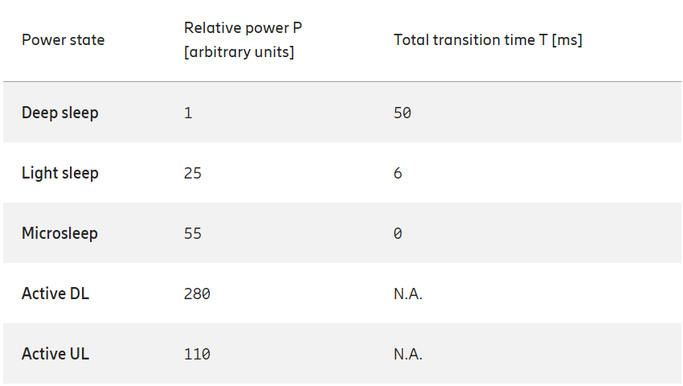
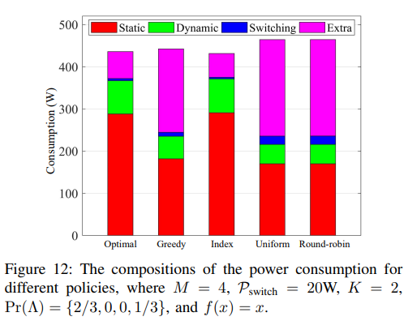
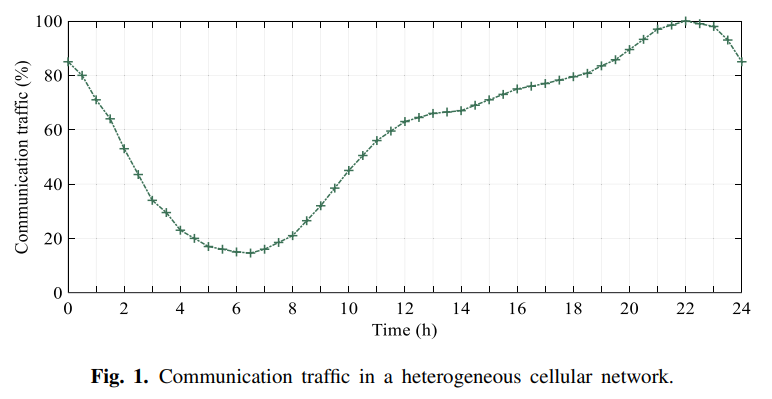

<!--
_paginate: hide
_header: ''
_footer: ''
-->
# Umweltbelastung von Moderner Mobilkommunikation

*Spezielle Themen Mobiler Kommunikationssysteme*
*Andreas Nicklaus*

[andreasnicklaus.github.io/mobcom-energy](https://andreasnicklaus.github.io/mobcom-energy/)

<!--

Hallo, willkommen zu meiner Vorstellung des Themas Umweltbelastung von Moderner Mobilkommunikation.
- nicht so festgenagelt oder sicher feststehend wie Max vor der Weihnachtspause
- mehr Idee, und Bedeutung und weniger Fachwissen, aber auch
-->
---

# Worum geht's heute?

1. Was ist Umweltbelastung?​
2. Wie stark ist der Einfluss von Mobilkommunikation auf den nat. Stromverbrauch?​
3. Wo kommt der Energieverbrauch her?​
4. Wie kann eingespart werden?​

<!-- 
Plan für die kommenden noch etwa 29 Minuten: 4 Fragen beantworten oder einführen

1. Was ist Umweltbelastung?
2. Wie stark ist die Umweltbelastung im Kontext der ersten Antwort?
3. Wo in der Mobilkommunikation, insbesondere in BS, kommt der Energieverbrauch her?
4. Interessantestes Thema am Ende, aber kurz, welche Strategien gibt es einzusparen?

a.k.a.:
1. Worüber reden wir, worüber nicht? Kriterien ohne Maß
2. Zahlen und Fakten zum Stromverbrauch
3. Wir verteilen sich die Zahlen?
4. Dieses Seminar: Spezielle Entwicklungen in der Mobilkommunikation im Themenbereich
 -->

--- 

# 1. Was ist Umweltbelastung?

<!--

Wenn es euch so geht, wie mir habt ihr zwar eine ungefähre Vorstellung von

- Effekt von Umweltbelastung
- schlimme Akteure bzgl. Umweltbelastung

Was zählt alles dazu außer der Kohlendioxidaustoß?

 -->

---

## Anwendbar: 10 von 27 Umweltindikatoren

| Klima und Energie        | Umwelt und Gesundheit​ | Ressourcen und Effizienz​     |
| ------------------------ | ---------------------- | ----------------------------- |
| Kohlendioxidemissionen ​ | Luftqualität​          | Verwertungsquote​             |
| Energieverbrauch         | Lärmbelastung​         | Ressourcenproduktivität​      |
| Erneuerbare Energien​    |                        | Siedlungs- und Verkehrsfläche |
|                          |                        | Flächenverbrauch​             |
|                          |                        | Altlasten​                    |

<!-- _footer: '[1]' -->

<!-- 
Das Bayerische Landesamt für Umwelt hat unsere Arbeit dahingehend getan, dass sie 27 Indikatoren für die Umweltbelastung festgelegt haben.
- Indikatoren, nicht Kriterien -> nicht schlecht, weil es zutrifft, sondern in Kombination
- -> Beispiel bringen

10 von den 27 sind interessant:

Klima und Energie (wenig überraschend)
Umwelt und Gesundheit (wenig überraschend)
Ressourcen und Effizienz (wenn etwas mal steht und funktioniert, wie lange und kann es wiederverwendet werden)

Info: 9 Indikatoren aus Natur und Landschaft treffen nicht zu

 -->

--- 

## Vernachlässigbare Umweltindikatoren

- Kohlendioxidemissionen
- Luftqualität
- Lärmbelastung
- Siedlungs- und Verkehrsfläche
- Flächenverbrauch
- Altlasten

<!-- 
Von den 10 Indikatoren, bei denen man sich vorstellen kann, dass sie zutreffend sein könnten, sind diese 6 erst mal vernachlässigbar.

Kohlendioxidemissionen und Luftqualität nur für Generator für  generelle Stromversorgung oder Notstromversorgung
Lärmbelastung genauso.

[keine Infos zu wie laut Base Stations sind]
TODO: Experiment zur Lautstärke von Base Stations

Siedlungs-und Verkehrsfläche und Flächenverbrauch schauen wir uns auf der nächsten Folie ganz kurz an.
Altlasten sind grob bleibende Schäden nach der Bebauung, hängen also eng mit der Baufläche zusammen.
-->
---

> Für den Betrieb einer Funkstation auf dem Dach werden etwa **10 m²** Technikstellfläche, für einen Mast ungefähr **150 m²** Grundfläche bzw. Technikstellfläche benötigt.

<!-- _footer: '[2]' -->

<!-- 
Wie sieht die Baufläche für eine Base Station aus?

[Foto] von LTE Antenne bei Halle Neustadt

Die Deutsche Funkturm, Unternehmen für den Ausbau von Infrastruktur für deutsche Mobilfunkanbieter, schreibt folgendes in die Ausschreibung für Standorte für Base Stations.

[Zitat]

Wir können daraus und etlichen Standorten erkennen, dass kaum neue Flächen für den Bau und Betrieb von Base Stations versiegelt werden müssen.
Die Siedlungs- und Verkehrsfläche, der Flächenverbrauch und die Altlasten sind also meiner Meinung nach weniger ein Thema für uns heute und mehr für Architekten und Stadtplaner, daher für jetzt mal vernachlässigbar.

 -->

---

## Relevante Umweltindikatoren

- Energieverbrauch
- Erneuerbare Energien
- Verwertungsquote
- Ressourcenproduktivität

<!-- 
Jetzt habe ich erfolgreich 6 von 10 Indikatoren hier als vernachlässigbar abgestempelt, also kommen wir bei den 4 Indikatoren an, mit denen wahrscheinlich ohnehin jeder gerechnet hat. :)

Energieverbrauch = Stromverbrauch
Erneuerbare Energien = Anteil an Strom von erneuerbaren Energiequellen
Verwertungsquote = Was kann wiederverwendet werden? erneuert / anders verwendet
Ressourcenproduktivität = erzielte Wirtschaftsleistung pro eingesetzter Ressourceneinheit

 -->

---

## Ressourcenproduktivität seit 1991

<!-- _footer: '[3]' -->

<!-- 
Was ist Ressourcenproduktivität

Mir hat das nichts gesagt und es sagt auch als absoluter Wert nichts aus, sondern als relativer Wert.

[Foto] beschreiben, Trend

[Vertrösten, dass nicht mehr dazu kommt, aber angesprochen bei Batterien]

 -->

---

## Batterien in gNB Base Stations
*Verwertungsquote und Ressourcenproduktivität*

- Lithium-Ionen Batterien
- Lebenszeit:
  - von 2-3 Jahren (max. 10) oder
  - 500-1000 Ladungen (max. 6000)
- Wiederverwendung:
  - Nach 20-30% Kapazitätsverlust
  - Wiederaufbereitung oder Repurposing
  - 40% der Produktionskosten bei Wiederaufbereitung

<!-- _footer: '[4, 5]'  -->

<!-- 
Wenn wir über die Batterien in next generation Base Stations sprechen, dann über die Leistung, was wir gleich vergleichen werden, aber insbesondere über die Lebensdauer und Wiederverwendung.

Eines der bekanntesten Batterientypen heute sind Lithium-Ionen Batterien, häufig in Verbindung gebracht mit Elektroautos.

Was die Lebenszeit angeht, gehen die Angaben stark auseinander, zwischen 2 und 10 Jahren und 500-6000 Ladungen findet man einige Zahlen.

Was die Wiederverwendung angeht, werden LI-Batterien oft nach ca. 20-30% Kapazitätsverlust ausgetauscht.
Dann gibt es 2 Möglichkeiten:

1. Wiederaufbereitung zu 40% der Produktionskosten: nochmal am selben Einsatzort einsetzen. Heute sogar zu fast 100% der Leistung
2. Repurposing: Wiederverwendung an einem anderen Einsatzort und -zweck.
  Aus der Ressource wird letztendlich bloß noch mehr Wirtschaftsleistung gepresst. 

LI-Batterien sind leider auch bekannt dafür, dass die Herstellung oft schädlich ist für Mensch und Natur. Deshalb schauen wir drauf, ob man in Zukunft aus der Ressource nicht mehr draus machen kann.
 -->

---

**Beispiel:** [PYLONTECH LiFePO4 Speicher 48V - 3,5kWh - US3000 C](https://greenakku.de/Batterien/Lithium-Batterien/48V-Lithium/PYLONTECH-LiFePO4-Speicher-48V-3-5kWh-US3000-C::1968.html?cq_src=google_ads&cq_cmp=19743368784&cq_con=&cq_term=&cq_med=pla&cq_plac=&cq_net=x&cq_pos=&cq_plt=gp&gad_source=1&gclid=Cj0KCQiA1rSsBhDHARIsANB4EJbcofjcW04gEaHBMIy2G2lUqBTGA6U-zwx9_wdNEFs3fF4dPTnSancaAhD7EALw_wcB)

<!-- 
Beispiel für Lithium-Eisenphosphat-Batterie

- 3,3kWh -> Leistung von BS 3kW
- Konsumentenverfügar
- Aneinanderketten für mehrere Batterien ohne Tiefenentladung oder Wechselausfälle

ca. 1000 €
 -->

---

## Leistungsdichte aktueller Batterien
|       | Lithium-Eisenphosphat-Batterien | Lithium-Schwefel-Batterien | Natrium-Ionen-Batterien |
| :---: | :-----------------------------: | :------------------------: | :---------------------: |
| Wh/kg |             200-300             |            300             |         140-160         |
| Wh/l  |             600-750             |            450             |         250-300         |

<!-- _footer: '[6]' -->

<!-- 
Alternativen für LiFePO4-Batterien:

1. Lithium-Schwefel-Batterien: gut, aber nicht so physisch dicht, wie LiFePO4, Herstellungsprobleme immernoch vorhanden, gerade im Kommen
2. Natrium-Ionen-Batterien: nicht ganz so gut, aber Herstellungsprobleme sind behoben, von umweltbewussten Unternehmen eingesetzt und es wird aktive Forschung betrieben

 -->
---

## Stromverbrauch von gNB Base Stations
*Energieverbrauch und Erneuerbare Energien*

- 240/400-Volt-Stromanschluss (3 kW)

- 14 200 Standorte mit > 43 000 Antennen **NICHT RICHTIG! 41945 Standorte (2022)**
- \>50% der Mobilfunkstationen haben 5G-Technologien

:arrow_right: $50\% * 14 200 \space \textrm{Standorte} * 3\frac{kW}{\textrm{Standort}} = 21,3 MW$

:arrow_right: $650 \frac{Wh}{l} / 3 kW = 13 \frac{\textrm{min}}{l}; \quad 250 \frac{Wh}{k} / 3 kW = 5 \frac{\textrm{min}}{kg}$

<!-- _footer: '[7]' -->

<!-- 
Strom in den Batterien -> Stromverbrauch einer gNB Basis Station
Indikatoren: Energieverbrauch und Erneuerbare Energien

- 1 240/400V-Anschluss, Leistung von 3kW
- in DE 14 200 Standorte mit über 43 000 Antennen
- über 50% davon mit 5G Ausstattung

[Hinweis auf 50%, SA und NSA NR und minimum 3kW]

[Rechnung 50% der Standorte]

[Rechnung auf ungewöhnliche Maße, aber gut für physische Größe und Masse und Verbrauch]

-> Mehr ist mehr
-->

---

## Erneuerbare Stromerzeugung in Deutschland

<!-- _footer: '[8]' -->

**Veraltet!** Bruttostromerzeugung im [3. Quartal 2023](https://www.destatis.de/DE/Presse/Pressemitteilungen/2023/12/PD23_462_43312.html)

<!-- 
Nutzung von erneuerbaren Energien hängt von der Stromerzeugung ab.

In DE in 2022 44% erneuerbare Energien, generell Windkraft deutlich mehr als Solarenergie oder Wasserkraft.

[neue Zahlen auf der Webseite angucken]

[Hinweis: In idealen Bedingungen generiert ein Solarpanel etwa 1000 Watt pro Quadratmeter Leistung]
[Hinweis: Solar und Wind nicht genutzt, weil die Batterien nicht so lange laufen können und BS verlässlich sein müssen]
-->

---
# 2. Wie stark ist der Einfluss von Mobilkommunikation auf den nat. Stromverbrauch?​

- Mobilfunkabdeckung von 89% im Juli 2023
- 14200 Standorte mit mehr als 43000 Antennen
- Jeder Standort á 3kW -> 42,6 MW -> ca. 373 GWh pro Jahr
- von zwischen ca. 500 und 552 TWh Stromverbrauch in DE in 2022
- rund 510 TWh inländisch erzeugt in Deutschland
- bis 2030 sollen 80% erneuerbare Energie sein, insb. Windkraft

<!-- 
Viel gelernt über die Stromerzeugung und Nutzung im Bereich Mobilkommunikation.

Vergleich der Nutzung und Einordnung in Deutschland
- Effizienz: 89% 5G-Abdeckung
- Standortrechnung ohne 50%
- 373,176 GWh pro Jahr
  
neue Infos:
- in DE zwischen 500-552 TWh in einem Jahr verbraucht
- davon 510 TWh inländisch erzeugt
- Politik: bis 2030 sollen 80% erneuerbar sein
-->

---

## Stromverbrauch zusammengefasst

- bei Betrieb dauerhaft 42,6 MW in Deutschland
- 13 Minuten / Liter verkraftbarer Stromausfall
- ca. **0,071% des Gesamtverbrauchs** in Deutschland gehen auf Basis Stationen zurück

<!-- 
Zusammengefasste Anforderungen

- dauerhaft 43 MW irgendwo herbekommen
- Überbrückung durch Batterien ist eingeschränkt durch Produktions- und Herstellungskosten
  - wie viele Batterien in einer BS: keine Infos, aber Bilder mit 5 Packs -> ca. 6 Stunden (Vermutung!)
- Zahl zum Mitnehmen 0,071% des Gesamtverbrauchs in Deutschland sind Base Stations

FIXME: Vermutung sollte nicht sein

-->

---

<!-- 
_class: centered
-->

## Was heißt das für uns?

Hier fehlen verlässliche Zahlen der Branche, Energieverbrauch des User Equipments und Effizienzrechnung $\frac{\textrm{Transmit Power}}{\textrm{Power Consumption}}$

<!-- 
Was heißt das für uns?

Keine Ahnung! So weit bin ich noch nicht

Hier fehlen verlässliche, also einheitliche Zahlen, UE, und Trasmit-Power/Power-Consumption
-->

---

# 3. Wo kommt der Energieverbrauch her?​

**Teile einer Base Station (4G):**
1. Antennensystem
2. RRU (Remote Radio Unit)
3. BBU (Baseband Unit)
4. Physical support (Stromversorgungssystem, Backup-Batterieen, Transmittion Equipment, Air Conditioning)

In 5G: RRU und Antennensysteme sind Active Antenna Units (AAU) und BBUs sind Centralized Units (CU) und Distributed (DU).

<!-- _footer: '[9]' -->

<!-- 
Stattdessen können wir uns darüber unterhalten, aus welchen Bauteilen eine Base Station besteht:

1. Antennensystem: für Laien und uns verständlich
2. RRU (Remote Radio Unit): Transceiver zwischen BBU & Antennen
3. BBU (Baseband Unit): verarbeitet Basisbandsignale von und zur Übertragung auf einer Frequenz, a.k.a. Modulation
4. Rest, um alles am Laufen zu halten
  1. Stromanschluss
  2. Batterien
  3. Transmission Equipment (Kabel, Adapter, nicht-usergerichtete Ausrüstung, Spannungswechsel etc.)
  4. Kühlung

In 5G sind wegen der Veränderungen der Begriffe und der Feingranularität der Standorte oft RRU und Antennen zusammengefasst in AAU und BBUs aufgeteilt in Centralized Units abseits der Base Station und Distributed Units, lokal nahe am Mast sind.
-->

---

<!-- _class: tableCenter -->

## Energieverbrauch pro Bauteil (circa)

|                            | volle Leistung | Idle     | Deep Sleep |
| -------------------------- | -------------- | -------- | ---------- |
| Active Antenna Units (AAU) | 1130-1180W     | 635-665W | 150-200W   |
| Baseband Units (BBU)       | 295-325W       | 295-320W | 295-320W   |
| Air Conditioning           | 1740W          | 1740W    | 1740W      |

<!-- _footer: '[10]' -->

<!-- 
Was davon verbraucht viel Strom?

In der Tabelle sehen wir, dass die BBU vergleichsweise wenig verbrauchen und AAU, sowie Air Conditioning am meisten Stromverbrauch haben.

Besonders interessant: Leistungsunterschied bei AAUs zwischen voller Leistung, Idle Modus und Deep Sleep
-> ca. 85% Einsparung

BBUs und Air Conditioning sind im Deep Sleep Modus der absolute Killer mit schlichtweg keiner Einsparung

[Wahrscheinlich nicht 100% wahre Zahlen, aber wir wahrscheinlich wahr: Micro Sleep ist bei AC nicht möglich]
-->

---

<!-- _footer: '[10]' -->

<!-- 
Hier sehen wir nochmal die Leistung nach Traffic Load etwas feingranularer.

[Hinweis auf den relativ kleinen Sprung bei AAU von 100% auf 50% Traffic Load]
 -->

---

# 4. Wie kann eingespart werden?​

1. Giga-MIMO
2. NR-Light
3. Lower Transmit Power for IoT devices (Reduced Capability NR)
4. Sidelink enhancements
5. Sleep Modes

<!-- 
Jetzt haben wir uns mal etwas intensiver angeschaut, wieviel unsere Hardware denn verbraucht, dann schauen wir mal drauf, was wir mit Controllern und Software generell oder cleveren Alternativen anrichten können, um die Verbrauchszahlen noch etwas zu drücken.

Dafür werde ich über diese 5 Themen in unterschiedlicher Ausführung drüber gehen und etwas dazu sagen, was das Ziel ist und wofür es genutzt werden kann.
 -->

---

##  Giga MIMO

- Vergrößerte Kapazität
- Verbesserter Throughput
- Längere Batterielebenszeit

*pot. weitere Verbesserungen in 6G*

<!-- 
[Frage, wer eine generelle Erklärung von Giga-MIMO braucht]

Giga MiMO ist in der Liste, nicht weil es dazu führt, dass der Gesamtverbrauch stark gesenkt wird, sondern weil es die insgesamte Effizenz der Base Station besser macht.

- Größe Kapazität an Daten und Verbindungen bringt mehr "Bang for the Buck"
- Längere Batterielebenszeit, weil die Ladung der Batterie seltener ausgereizt wird, wenn wir Antennen gezielt an- und ausschalten. Batterien werden seltener vollständig entladen.

---

In 6G ist außerdem das Ziel ausgesprochen, dass Giga MIMO noch stärker genutzt und verbessert werden soll, was in unserem Kontext ja bloß positiv sein kann.

---

Giga MIMO ist basically Massive MIMO auf 7-16 GHz mit noch engeren Antennenteilen und einer Reichweite von max. 500 Metern

-->

---

##  NR-Light

- Geringere Kapazität
- Geringere Komplexität <small style="color: grey;">(150Mbps DL / 50 Mbps UL, 13-30ms latency)</small>
- Geringerer Stromverbrauch

<!-- 
Wer gedacht hat, dass wir ohnehin schon viele Standards und Kommunikationsvarianten haben, darf sich jetzt freuen.

[Wer hat schon von NR-Light gehört?]

Basically, NR-Light ist die kleine Schwester von 5G NR und bringt weniger Kapazität, weniger Komplexität und dadurch einen geringeren Stromverbrauch.

Man kann sich vorstellen, weniger oder weniger gute Hardware mit all den Software-Spielereien und technologischen Tricks, die wir haben.

Die Eckdaten für Nutzer sind hier
- max. 150 Mbps DL
- max. 50 Mbps UL
- 13-30 ms Latency

[besser als mein W-Lan zuhause]
-->

---

##  Reduced Capability (RedCap) NR

<!-- 
Genau da, bei Abgeschwächten Versionen, machen wir jetzt weiter, namentlich mit Reduced Capability, RedCap, NR.

Wir sehen hier den Vergleich von 2021 von einem Baseline Device, das ein vollumfängliches User Equipment ist, und einem RedCap Device auf je 2 Frequency Ranges, welche habe ich nicht mehr im Kopf.

- Geringere genutzte Bandbreite
- Weniger Antennen
- Weniger Downlink MIMO layer (Verbindung zu Device Receive Branches)
- Kleinere Konstellationsmatrizen für Modulierung
- Geringere Duplexfunktionalität

FDD: Frequency Division Duplex
TDD: Time Division Duplex
 -->

<!-- _footer: '[11]' -->

---

##  Reduced Capability (RedCap) NR

<!-- _footer: '[11]' -->

<!-- 
[Graphische Darstellung von Kommunikation eines RedCapUE und eines Legacy UE]

QAM: Quadrature amplitude modulation
 -->

---

##  Reduced Capability (RedCap) NR

<em>Quadrature amplitude modulation</em>

<!-- 
[Darstellung von QAM: Aus Phase und Amplitude 4 Bits]
 -->

---

##  Reduced Capability (RedCap) NR

- Geringere Bandbreite (20-100 MHz)
- Geringere Anzahl an Receive Antennen
- Kleinere Konstellationsmatrizen für Modulierung
- Optionaler Duplex

<!-- _footer: '[11]' -->

<!-- 
Aus diesem technischen Schritt, den das UE entscheiden kann können wir die Ressourcen, die wir haben in kleinere Stücke für mehr Geräte und Verbindungen teilen.

Wir haben also
- Geringere Bandbreite (20-100 MHz)
- Geringere Anzahl an Receive Antennen
- Kleinere Konstellationsmatrizen für Modulierung
- Optionaler Duplex
 -->

---

## NR Sidelink

- basiert auf LTE Sidelink
- Device-to-Device (D2D) Kommunikation
- Distributed Networking - "Distributed Base Stations"

<!-- _footer: '[12]' -->

<!-- 
Jetzt kommen wir zu meinem absoluten Favourite der Themen

- Sidelinking exisitiert seit LTE
- erlaubt Device-to-Device Kommunikation anstelle von Network-to-Device
- Distiibuted Networking oder Distributed Base Stations
  - Teile der Funktionen ausgelagert (Verbindungsverwaltung)
  - Stellvertreterverbindung zur Base Station
 -->

---

<!-- _footer: '[12]' -->

<!-- 
[Graphik von Qualcomm erklären]

- Geräte mit 5G-Kapazitäten, Wearables oder Drohnen
- Notfalltrupp wie Feuerwehr brauchen bloß ein ausgerüstetes Einsatz-Fahrzeug
- Netz, wo keines ist
-->

---

### Verbesserungen durch NR Sidelink

- Erhöhte (Sidelink-)Reichweite
- Vergrößerte Kapazität
- Data Offload

<!-- _footer: '[12]' -->

<!-- 
in 5G neu:
- Größere Reichweite: Nützlicher und besser zusammen mit...
- Größere Kapazität: Mehr Verbindungen gleichzeitig über Stellvertretergerät
- Data Offload: Direkte Kommunikation zwischen Geräten im Edge Netzwerk ohne Beteiligung von BS

-> Strom sparen durch kleinere Netze und Nicht-Nutzung von Base Stations
 -->

---

## Sleep Modes

<!-- _footer: '[13]' -->

<!-- 
Zu guter letzt will ich noch kurz das Problem und die Möglichkeiten von Sleep Modes ansprechen, bevor wir in eine Fragerunde übergehen

Wir sehen hier, ohne Maße, wie start der Unterschied Leistungsunterschied ist zwischen den verfügbaren Schlafmodi.

- Microsleep ist basically Idle Modus, also schlichtweg inaktiv
- Light Sleep ist ein tatsächlicher Sleep Mode, bei dem wirklich Teile der Hardware abgeschaltet werden und neu hochgefahren werden müssen
- Deep Sleep bedeutet die Abschaltung von der meisten Hardware, sodass nur das notwendige zum automatisierten Neustart noch an ist

Im Vergleich Active DL und Active UL

Die Transition Times und Unterschiede im Power lassen mich vermuten, dass es da großes Potenzial zur Verbesserung gibt, insb. da kaum ein Nutzer merken würde, wenn es eine zusätzliche Latenz von 6 ms gibt.
 -->

---

## Sleep Modes

<!-- _footer: '[13]' -->

<!-- 
Diese Graphik von 2022 zeigt das tatsächliche Ausmaß von Switching Policies, sogar mit eingerechneter Switching Power von 20W

Der Unterschied ist, wenn ich erlich bin, ernüchternd. Wir reden von einem Faktor von 280 zwischen Deep Sleep und Active DL und trotzdem haben wir einen Power Consumption Unterschied hier von vielleicht 50W.
 -->

---

### Täglicher Traffic

<!-- _footer: '[14]' -->

<!-- 
Ein anderes Paper von August 0223, das ich mir zur Hand genommen habe, nimmt den Tagesverlauf als entscheidende Graphik.

Hier sehen wir nochmal das, worüber ich vor einigen Wochen schon mal gesprochen habe, nämlich, dass der Unterschied an Auslastung im Netz zwischen früh morgens und tagsüber bis abends sehr deutlich ist.
 -->

---

## Sleep Modes

<!-- _footer: '[15]' -->
<!--
Und hier sehen wir ein paar Kombinationen an Sleep Mode Strategien und deren Stromverbrauch über die gleichen 24h hinweg.

Und mit diesem Cliffhanger, was theoretisch möglich wäre, will ich für heute Schluss machen...

ECOS: Energy Consumption Optimization of 5G BSs
IMAP: Initial Matching Association Process
FTSS: Fixed threshold sleep strategy
MTRS: Maximum transmission rate user association strategy
-->

---
<!-- 
_header: ''
_paginate: skip
-->

<!--
... und wenn es geht auf eure Fragen eingehen
 -->

---

<!-- _class: tableCenter smalltable -->

# Abkürzungsverzeichnis

| Abkürzung | Bedeutung                                           |
| --------- | --------------------------------------------------- |
| NR        | New Radio (5G)                                      |
| FDD       | Frequency Division Duplex                           |
| TDD       | Time Division Duplex                                |
| ECOS      | Energy Consumption Optimization of 5G BSs           |
| IMAP      | Initial Matching Association Process                |
| FTSS      | Fixed threshold sleep strategy                      |
| MTRS      | Maximum transmission rate user association strategy |
| QAM       | Quadrature amplitude modulation                     |

---

<!-- _class: small -->

# Literaturverzeichnis (1/2)

[1] ["Alle Umweltindikatoren auf einen Blick", Bayerisches Landesamt für Umwelt, https://www.lfu.bayern.de/umweltdaten/indikatoren/liste_indikatoren/index.htm](https://www.lfu.bayern.de/umweltdaten/indikatoren/liste_indikatoren/index.htm)
[2] ["Mobilfunkausbau unterstützen - Antennenstandort anbieten", Deutsche Funkturm, https://www.dfmg.de/de/ihr-standortangebot-an-uns/anmietung-von-flaechen.html](https://www.dfmg.de/de/ihr-standortangebot-an-uns/anmietung-von-flaechen.html)
[3] ["Ressourcenproduktivität", Bayerisches Landesamt für Umwelt, https://www.lfu.bayern.de/umweltdaten/indikatoren/ressourcen_effizienz/ressourcenproduktivitaet/index.htm](https://www.lfu.bayern.de/umweltdaten/indikatoren/ressourcen_effizienz/ressourcenproduktivitaet/index.htm)
[4] ["How Long Do Lithium-Ion Batteries Last?", Li Time, 8.5.2023, https://www.litime.com/blogs/blogs/how-long-do-lithium-ion-batteries-last](https://www.litime.com/blogs/blogs/how-long-do-lithium-ion-batteries-last)
[5] [Toward Sustainable Reuse of Retired Lithium-ion Batteries from Electric Vehicles, Conservation and Recycling, Volume 168, 2021, Yang et al.](https://linkinghub.elsevier.com/retrieve/pii/S0921344920305644)
[6] "Muss es Lithium sein?", c´t 2023, Heft 26, Heise Medien, ISSN 0724-8679
[7] ["Ausbau des 5G-Netzes schreitet weiter voran. 5G jetzt für 90% der Bevölkerung", Newsroom Vodafone, 20.08.2023, https://newsroom.vodafone.de/netz/mobilfunk-netzausbau-5g-netz-fur-90-prozent-der-bevolkerung](https://newsroom.vodafone.de/netz/mobilfunk-netzausbau-5g-netz-fur-90-prozent-der-bevolkerung)
[8] ["Bruttostromerzeugung 2022", Statistisches Bundesamt (Destatis), https://www.destatis.de/DE/Themen/Branchen-Unternehmen/Energie/_Grafik/_Interaktiv/bruttostromerzeugung-erneuerbare-energien.html](https://www.destatis.de/DE/Themen/Branchen-Unternehmen/Energie/_Grafik/_Interaktiv/bruttostromerzeugung-erneuerbare-energien.html)

---

<!-- _class: small -->

# Literaturverzeichnis (2/2)

[9] ["What is Base Station?", IPLOOK, 2023, https://www.iplook.com/info/what-is-base-station-i00169i1.html](https://www.iplook.com/info/what-is-base-station-i00169i1.html)
[10] ["Remake Green 5G, Mobile Innovation for Climate Action", China Telecom and ZTE, https://www.zte.com.cn/content/dam/zte-site/res-www-zte-com-cn/white_paper/Remake_Green_5G.pdf](https://www.zte.com.cn/content/dam/zte-site/res-www-zte-com-cn/white_paper/Remake_Green_5G.pdf)
[11] ["What is reduced capability (RedCap) NR and what will it achieve?", Ericsson, 11.02.2021, https://www.ericsson.com/en/blog/2021/2/reduced-cap-nr](https://www.ericsson.com/en/blog/2021/2/reduced-cap-nr)
[12] ["How will sidelink bring a new level of 5G versatility?", Qualcomm, 08.09.2022, https://www.qualcomm.com/news/onq/2022/09/how-will-sidelink-bring-a-new-level-of-5g-versatility](https://www.qualcomm.com/news/onq/2022/09/how-will-sidelink-bring-a-new-level-of-5g-versatility)
[13] Dynamic gNodeB Sleep Control for Energy-Conserving 5G Radio Access Network; Pengfei Shen et al., 13.07.2022
[14] Energy consumption optimization of 5G base stations considering variable threshold sleep mechanism; August 2023; Xiaoyan Ma et al.; Science Direct, Volume 9, Supplement 6
[15] Energy consumption optimization of 5G base stations considering variable threshold sleep mechanism; August 2023; Xiaoyan Ma et al.; Science Direct, Volume 9, Supplement 6

---

<!-- _class: centered
 -->

# Presenter

Andreas Nicklaus

  

    <a href="https://www.instagram.com/andreasnicklaus">
      
       
      @andreasnicklaus
    </a>
  

  

    <a href="https://www.linkedin.com/in/andreasnicklaus/">
      
       
      andreasnicklaus
    </a>
  

  

    <a href="https://www.www.andreasnicklaus.de">
      
       
      andreasnicklaus.de
    </a>
  

